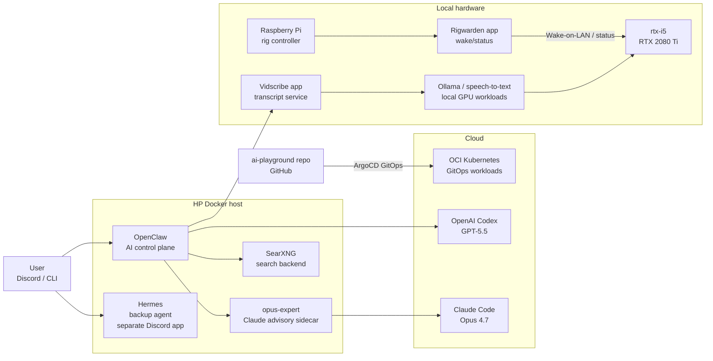

# AI Playground

A working repository for AI-assisted engineering experiments across DevOps, Kubernetes, homelab automation, and LLM-powered tools.

The goal is simple: build useful systems, keep them cost-conscious, and document how the architecture evolves over time. The [homelab/](homelab/) directory is the meta view — current architecture plus a public-safe changelog of infrastructure changes.

## Current architecture

## AI-assisted engineering

This repo started with Claude Code, then moved to OpenAI Codex with GPT-5.5 after practical comparison in daily use. Codex is now the main coding and operations assistant. Claude remains available through `opus-expert`, exposed through an OpenAI-compatible REST API and connected to OpenClaw as a model for critical review, second opinions, and deeper critique.

The human part is still the important part: architecture, requirements, tradeoffs, operations, and review. AI makes the implementation loop faster.

## Projects

| Project | Description |
|---------|-------------|
| [hidden-jobs](hidden-jobs/) | CLI tool that uses LLM-generated Google X-Ray searches to find job postings hidden on company career pages and ATS platforms. Supports OpenAI, Anthropic, Google, and local models via Ollama. |
| [k8s-oci-cluster](k8s-oci-cluster/) | Terraform-managed Kubernetes cluster on OCI Always Free tier — 2 ARM worker nodes with nginx ingress, external-dns (Cloudflare), cert-manager (Let's Encrypt), and Argo CD for GitOps. |
| [homelab](homelab/) | Living documentation of my homelab — current architecture, Mermaid diagrams, and a changelog of every change across the cluster, edge devices, and networking. |
