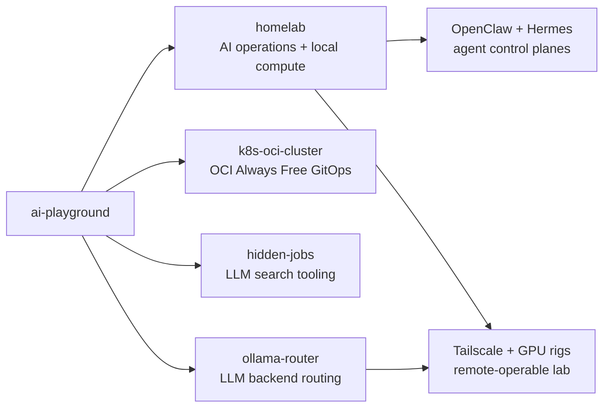

# AI Playground

A working repository for AI-assisted engineering across DevOps, Kubernetes, homelab automation, and LLM-powered tools.

The repo is built around real systems rather than isolated demos: an OCI Always Free GitOps cluster, a Tailscale-connected homelab with peer agent control planes, local GPU inference, and small LLM tools that solve concrete tasks. The [homelab/](homelab/) directory is the meta view: current architecture plus a public-safe changelog of infrastructure changes.

## Repo Map

## AI-assisted engineering

This repo started with Claude Code, then moved to OpenAI Codex with GPT-5.5 after practical comparison in daily use. Codex is now the main coding and operations assistant. Claude remains available through `opus-expert`, exposed through an OpenAI-compatible REST API and connected to OpenClaw as a model for critical review, second opinions, and deeper critique.

The human part is still the important part: architecture, requirements, tradeoffs, operations, and review. AI makes the implementation loop faster, but the work is grounded in infrastructure that actually runs.

## Start Here

| Area | What to inspect |
|---------|-------------|
| [homelab](homelab/) | Current AI operations architecture, Tailscale-connected GPU rigs, Rigwarden wake/status control, and the public changelog showing how the lab evolved. |
| [k8s-oci-cluster](k8s-oci-cluster/) | Terraform-managed OCI Always Free Kubernetes cluster with nginx ingress, external-dns, cert-manager, and Argo CD GitOps. |
| [hidden-jobs](hidden-jobs/) | LLM-assisted search tooling for finding job postings hidden on company career pages and ATS platforms. |
| [ollama-router](https://github.com/maslankalm/ollama-router) | Standalone OpenAI-compatible FastAPI router for Ollama backends. This repo carries the OCI/Argo CD deployment manifests under `k8s-oci-cluster/apps/ollama-router`; the app code and GHCR image live in the separate public repository. |
| [k8s-manifest-reviewer](https://github.com/maslankalm/k8s-manifest-reviewer) | Public demo app that reviews Kubernetes YAML with local RTX 2080 Ti inference and Ollama Cloud fallback through `ollama-router`. Deployment manifests live under `k8s-oci-cluster/apps/k8s-manifest-reviewer`. |
