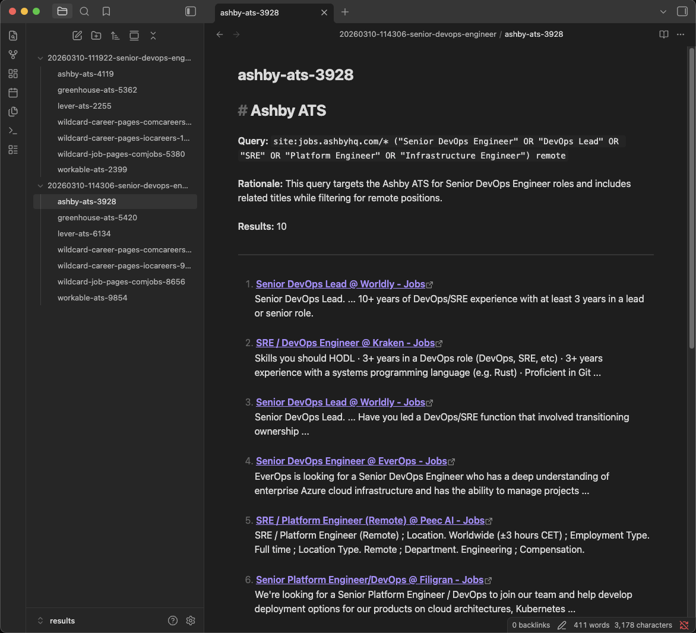

# Hidden Jobs

LLM-assisted Google X-Ray search tool for finding roles that are easy to miss when relying only on job boards.

## What It Does

Many roles are filled through company career pages, internal ATS platforms, and other channels that are not obvious from traditional job boards. Instead of manually crafting Google X-Ray searches, this tool asks an LLM to read the [search techniques guide](Google-X-Ray.md) and a job description, then generate targeted Boolean queries for common ATS platforms and company career pages.

The search results are saved as Markdown files so they can be reviewed, filtered, and reused later.

## What This Shows

- **LLM as planning layer** — the model turns a role description into a compact set of search strategies instead of blindly scraping.
- **Provider flexibility** — model calls go through [LiteLLM](https://docs.litellm.ai/), so OpenAI, Anthropic, Google, and local Ollama models can be used.
- **API-cost awareness** — generated queries are intentionally grouped to reduce Serper API usage, and multiple Serper keys can rotate when credits run out.
- **Human-reviewable output** — results are written as Markdown, making them easy to inspect in a normal editor or Obsidian.

## Setup

```bash
cd hidden-jobs
pip install -r requirements.txt
```

Create a `.env` file (see `.env.example`):

```
# Set the key for whichever LLM provider you use.
OPENAI_API_KEY=sk-...
# ANTHROPIC_API_KEY=sk-ant-...
# GEMINI_API_KEY=...

SERPER_API_KEYS=key1,key2,key3
```

Get a free Serper API key at https://serper.dev. Multiple comma-separated keys are supported and rotate automatically when credits run out.

## Usage

```bash
# From a text file
python main.py --file jd.txt

# Inline description
python main.py --text "Senior DevOps Engineer with Kubernetes experience, remote"

# From stdin
cat jd.txt | python main.py

# More pages per query (default 1, ~10 results each, 1 credit per page)
python main.py --text "DevOps Engineer" --pages 3

# Use a different LLM
python main.py --text "DevOps Engineer" --model claude-sonnet-4-20250514

# Use a local model via Ollama (free, no API key needed)
python main.py --text "DevOps Engineer" --model ollama/qwen3:14b
```

Results are saved as Markdown files in a timestamped directory under `results/`, one file per generated query.

## How It Works

1. Read the role description from a file, inline text, or stdin.
2. Load the Google X-Ray search guide from [`Google-X-Ray.md`](Google-X-Ray.md).
3. Ask the selected model to generate ATS- and career-page-specific Boolean queries.
4. Search Google through Serper, rotating keys if needed.
5. Save categorized Markdown result files for review.

> [!TIP]
> **Reviewing results with Obsidian** — [Obsidian](https://obsidian.md/) is great for browsing the generated markdown files — just open `results/` as a vault.


