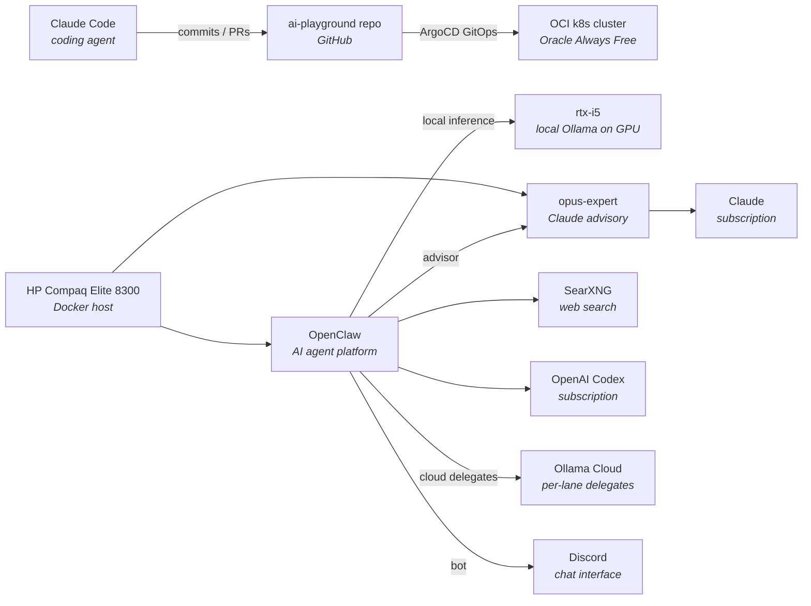

# Homelab

Living documentation of my homelab — the infrastructure side of an AI learning journey. This directory captures *what's running*, *how the pieces fit together*, and *every change along the way*.

Kept cost-free where possible (free tiers, self-hosting, local models) so the focus stays on learning.

## Current state

A Kubernetes cluster on Oracle Cloud drives GitOps workloads. An HP node runs two AI platforms side by side — OpenClaw (agent platform on an OpenAI Codex subscription) and `opus-expert` (Claude advisory system on a Claude subscription). OpenClaw delegates narrow tasks to Ollama models, picked per lane after benchmarking: running either on Ollama's hosted cloud or on `rtx-i5`, a private GPU rig (i5-9400F / RTX 1080) that serves local inference on owned hardware.

## Components

| Component | Role | Link |
|---|---|---|
| Claude Code | Coding agent driving all changes in this repo | [docs](https://docs.anthropic.com/en/docs/claude-code/overview) |
| OCI k8s cluster | Compute target for workloads, GitOps via ArgoCD | [`../k8s-oci-cluster/`](../k8s-oci-cluster/) |
| HP Compaq Elite 8300 | Dedicated Docker host for AI agents and automation | — |
| OpenClaw | AI agent platform, OpenAI Codex subscription | — |
| SearXNG | Local web search backend for OpenClaw | — |
| Ollama cloud delegates | Per-lane workers for OpenClaw — GLM 5.1 leads coding (MiniMax backup); DeepSeek / Gemma 4 31B / Kimi trio handles research | [ollama.com](https://ollama.com/) |
| rtx-i5 | Private GPU inference rig (i5-9400F / 32 GB / RTX 1080), Ollama in Docker with GPU passthrough, LAN-only | — |
| opus-expert | Claude advisory system on HP, CLI (`ask-opus`) + internal REST API; also consulted by OpenClaw as an expert advisor | — |

## Changelog

Every homelab change — across the cluster, future edge devices, networking, and AI milestones — is logged in [`CHANGELOG.md`](CHANGELOG.md) in reverse-chronological order.
