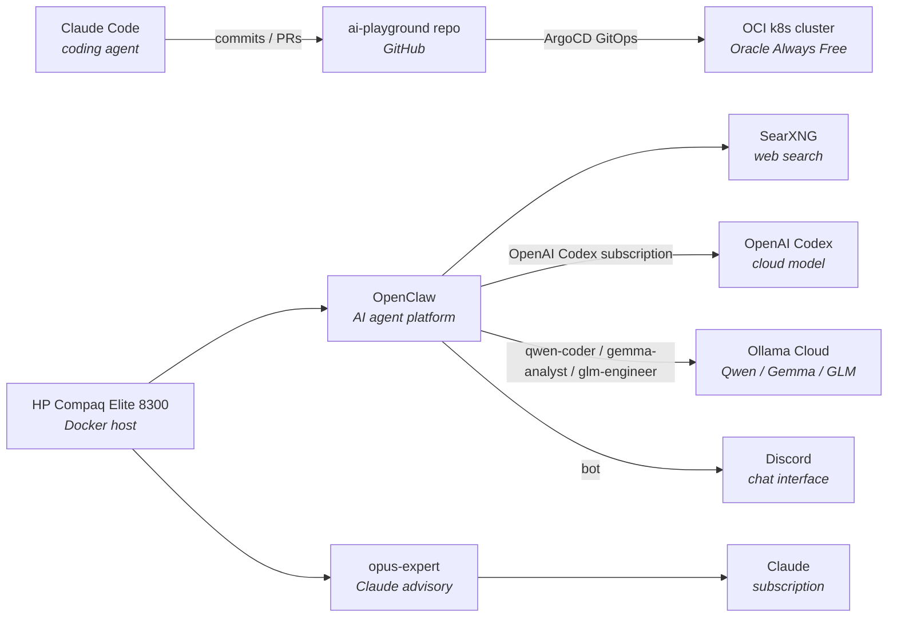

# Homelab

Living documentation of my homelab — the infrastructure side of an AI learning journey. This directory captures *what's running*, *how the pieces fit together*, and *every change along the way*.

Kept cost-free where possible (free tiers, self-hosting, local models) so the focus stays on learning.

## Current state

A Kubernetes cluster on Oracle Cloud drives GitOps workloads, and a dedicated HP node runs two AI platforms side by side: OpenClaw (agent platform backed by OpenAI Codex with Ollama cloud delegates for narrow tasks) and `opus-expert` (Claude advisory system on the Claude subscription).

## Components

| Component | Role | Link |
|---|---|---|
| Claude Code | Coding agent driving all changes in this repo | [docs](https://docs.anthropic.com/en/docs/claude-code/overview) |
| OCI k8s cluster | Compute target for workloads, GitOps via ArgoCD | [`../k8s-oci-cluster/`](../k8s-oci-cluster/) |
| HP Compaq Elite 8300 | Dedicated Docker host for AI agents and automation | — |
| OpenClaw | AI agent platform, OpenAI Codex subscription | — |
| SearXNG | Local web search backend for OpenClaw | — |
| Ollama cloud delegates | `qwen-coder` (Qwen3 Coder), `gemma-analyst` (Gemma 4 31B), `glm-engineer` (GLM 5.1) — narrow-task delegates for OpenClaw | [ollama.com](https://ollama.com/) |
| opus-expert | Claude advisory system on HP, CLI (`ask-opus`) + internal REST API | — |

## Changelog

Every homelab change — across the cluster, future edge devices, networking, and AI milestones — is logged in [`CHANGELOG.md`](CHANGELOG.md) in reverse-chronological order.
