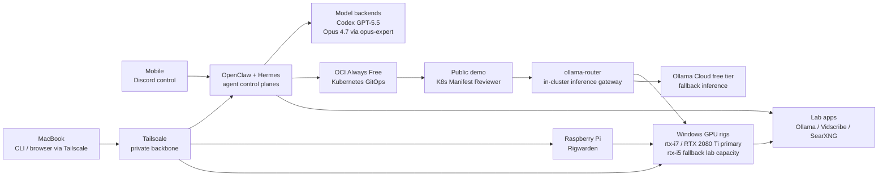

# Homelab

Living documentation of my homelab: AI control planes, GitOps infrastructure, private networking, and local GPU compute. The setup is kept cost-conscious where possible, using free tiers, self-hosting, and owned hardware instead of paid services when reliability or control matters.

## Snapshot

The lab has two peer operating surfaces. OpenClaw handles direct Discord-driven execution on GPT-5.5, while Hermes adds a Kanban-oriented way to coordinate multiple agents. `opus-expert` is exposed to OpenClaw as an OpenAI-compatible expert model backed by Claude Code / Opus 4.7 for critical review.

Tailscale is the private backbone. Full lab operation happens from a MacBook over Tailscale, while mobile access stays Discord-first for talking to the agents. This keeps deep administration on a proper workstation while still making the agent layer reachable while traveling.

OCI Always Free runs the Kubernetes/GitOps side, including the public Kubernetes Manifest Reviewer demo and the internal `ollama-router` gateway it uses. Local hardware fills the gaps cloud delegates do not: the Windows-rebuilt `rtx-i7` / RTX 2080 Ti rig is the primary local inference path, `rtx-i5` remains fallback lab capacity, both can run local Ollama, and Rigwarden handles wake/status control from a Raspberry Pi. Ollama Cloud free tier is kept as an inference fallback for the public demo rather than the primary path.

## Operating Model

## What Runs Here

**Agent control**

- **OpenClaw** — main direct execution surface, led by GPT-5.5 with internal worker delegation.
- **Hermes** — peer agent on a separate Discord application, using a Kanban board to coordinate multi-agent infrastructure work.
- **opus-expert** — Claude advisory system exposed through an OpenAI-compatible REST API and connected to OpenClaw as an expert model.

**Infrastructure**

- **OCI Always Free Kubernetes** — GitOps workload target managed from [`../k8s-oci-cluster/`](../k8s-oci-cluster/), currently running `ollama-router` and the public Kubernetes Manifest Reviewer demo.
- **HP Docker host** — dedicated home node for AI agents, automation, and support services.
- **Tailscale** — private network backbone for remote operation without exposing internal services publicly.

**Local compute**

- **rtx-i7** — primary private GPU inference rig with RTX 2080 Ti, rebuilt as a Windows 11 + Docker Desktop GPU host.
- **rtx-i5** — fallback private GPU inference rig with GTX 1080, also rebuilt as a Windows 11 + Docker Desktop GPU host.
- **Local Ollama** — self-hosted model runtime on the GPU rigs; the public demo runs `ministral-3:8b`, prefers the RTX 2080 Ti path through `ollama-router`, and falls back to Ollama Cloud free tier when local inference is unavailable.

## Lab Apps

- **Kubernetes Manifest Reviewer** runs publicly on the OCI cluster at <https://k8s-manifest-reviewer.maslanka.io>. It reviews small Kubernetes manifests with `ministral-3:8b` and routes inference through the in-cluster `ollama-router` to local RTX 2080 Ti inference with Ollama Cloud free-tier fallback. GitOps manifests live in [`../k8s-oci-cluster/apps/k8s-manifest-reviewer/`](../k8s-oci-cluster/apps/k8s-manifest-reviewer/).
- **ollama-router** runs internally in the OCI cluster as the OpenAI-compatible inference gateway for cluster apps. It has no public ingress; apps call it through Kubernetes service DNS. GitOps manifests live in [`../k8s-oci-cluster/apps/ollama-router/`](../k8s-oci-cluster/apps/ollama-router/), while the reusable app code lives in [`maslankalm/ollama-router`](https://github.com/maslankalm/ollama-router).
- **Rigwarden** runs on the Raspberry Pi controller and provides GPU rig wake/status control: UI for the operator, API for agents. 
  

- **Vidscribe** turns video sources into reusable transcript artifacts with local sound-to-text fallback.
- **SearXNG** provides local search support for agent workflows.

## Changelog

Every homelab change across the cluster, local hardware, networking, and AI control plane is logged in [`CHANGELOG.md`](CHANGELOG.md).
