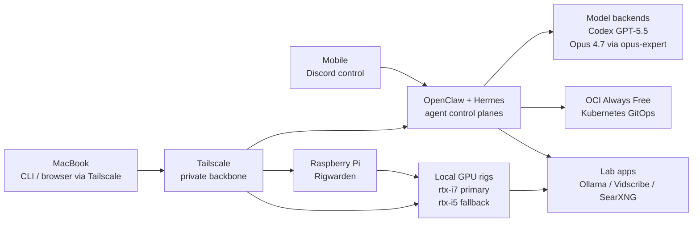
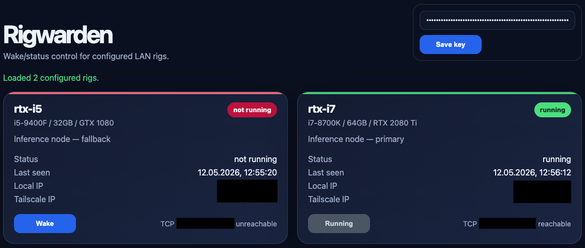

# Homelab

Living documentation of my homelab: AI control planes, GitOps infrastructure, private networking, and local GPU compute. The setup is kept cost-conscious where possible, using free tiers, self-hosting, and owned hardware instead of paid services when reliability or control matters.

## Snapshot

The lab has two peer operating surfaces. OpenClaw handles direct Discord-driven execution on GPT-5.5, while Hermes adds a Kanban-oriented way to coordinate multiple agents. `opus-expert` is exposed to OpenClaw as an OpenAI-compatible expert model backed by Claude Code / Opus 4.7 for critical review.

Tailscale is the private backbone. Full lab operation happens from a MacBook over Tailscale, while mobile access stays Discord-first for talking to the agents. This keeps deep administration on a proper workstation while still making the agent layer reachable while traveling.

OCI Always Free runs the Kubernetes/GitOps side. Local hardware fills the gaps cloud delegates do not: `rtx-i7` is the primary inference rig, `rtx-i5` is fallback capacity, both can run local Ollama, and Rigwarden handles wake/status control from a Raspberry Pi.

## Operating Model

## What Runs Here

**Agent control**

- **OpenClaw** — main direct execution surface, led by GPT-5.5 with internal worker delegation.
- **Hermes** — peer agent on a separate Discord application, using a Kanban board to coordinate multi-agent infrastructure work.
- **opus-expert** — Claude advisory system exposed through an OpenAI-compatible REST API and connected to OpenClaw as an expert model.

**Infrastructure**

- **OCI Always Free Kubernetes** — GitOps workload target managed from [`../k8s-oci-cluster/`](../k8s-oci-cluster/).
- **HP Docker host** — dedicated home node for AI agents, automation, and support services.
- **Tailscale** — private network backbone for remote operation without exposing internal services publicly.

**Local compute**

- **rtx-i7** — primary private GPU inference rig with RTX 2080 Ti.
- **rtx-i5** — fallback private GPU inference rig with GTX 1080.
- **Local Ollama** — self-hosted model runtime on the GPU rigs, replacing the unreliable Ollama Cloud path.

## Lab Apps

- **Rigwarden** runs on the Raspberry Pi controller and provides GPU rig wake/status control: UI for the operator, API for agents. 
  

- **Vidscribe** turns video sources into reusable transcript artifacts with local sound-to-text fallback.
- **SearXNG** provides local search support for agent workflows.

## Changelog

Every homelab change across the cluster, local hardware, networking, and AI control plane is logged in [`CHANGELOG.md`](CHANGELOG.md).
