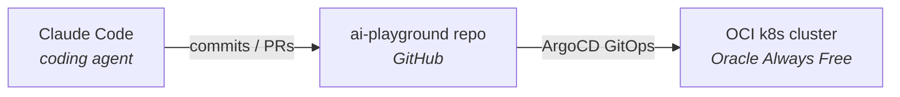

# Homelab

Living documentation of my homelab — the infrastructure side of an AI learning journey. This directory captures *what's running*, *how the pieces fit together*, and *every change along the way*.

Kept cost-free where possible (free tiers, self-hosting, local models) so the focus stays on learning.

## Current state

First step of the homelab is already in place: a Kubernetes cluster running on Oracle Cloud's Always Free tier, driven by Claude Code through GitOps.

## Components

| Component | Role | Link |
|---|---|---|
| Claude Code | Coding agent driving all changes in this repo | [docs](https://docs.anthropic.com/en/docs/claude-code/overview) |
| OCI k8s cluster | Compute target for workloads, GitOps via ArgoCD | [`../k8s-oci-cluster/`](../k8s-oci-cluster/) |

## Changelog

Every homelab change — across the cluster, future edge devices, networking, and AI milestones — is logged in [`CHANGELOG.md`](CHANGELOG.md) in reverse-chronological order.
