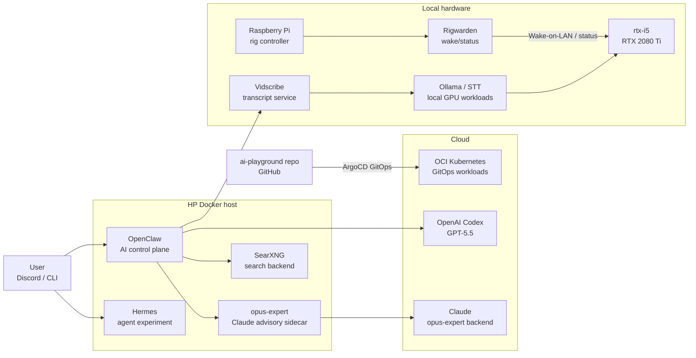

# Homelab

Living documentation of my homelab — the infrastructure side of an AI learning journey. This directory captures *what's running*, *how the pieces fit together*, and *every change along the way*.

Kept cost-free where possible (free tiers, self-hosting, local models) so the focus stays on learning.

## Current state

A Kubernetes cluster on Oracle Cloud drives GitOps workloads. An HP node runs the AI control plane: OpenClaw, led by Leah on GPT-5.5, Hermes as a separate Discord-connected agent experiment, and `opus-expert` as a Claude advisory sidecar. OpenClaw can use internal workers for narrow tasks, with GPT-5.5 workers and `opus-expert` available for second opinions and critique.

Local hardware is used where it adds something the cloud delegates do not. `rtx-i5`, a private GPU rig (i5-9400F / RTX 2080 Ti), serves local inference and local STT workloads on owned hardware. Rigwarden now runs on a Raspberry Pi near the rigs for wake/status control, while Vidscribe turns video sources into reusable transcript artifacts.

## Components

| Component | Role | Link |
|---|---|---|
| Claude Code | Coding agent driving all changes in this repo | [docs](https://docs.anthropic.com/en/docs/claude-code/overview) |
| OCI k8s cluster | Compute target for workloads, GitOps via ArgoCD | [`../k8s-oci-cluster/`](../k8s-oci-cluster/) |
| HP Compaq Elite 8300 | Dedicated Docker host for AI agents and automation | — |
| OpenClaw | AI agent platform, Leah/GPT-5.5-led Discord control plane with internal worker delegation | — |
| Hermes | Separate Discord-connected agent experiment running beside OpenClaw | — |
| SearXNG | Local web search backend for OpenClaw | — |
| Raspberry Pi rig controller | Low-power controller near the GPU rigs, running Rigwarden for wake/status | — |
| rtx-i5 | Private GPU inference rig (i5-9400F / 32 GB / RTX 2080 Ti), Docker with GPU passthrough, LAN-only | — |
| opus-expert | Claude advisory system on HP, CLI (`ask-opus`) + internal REST API; also consulted by OpenClaw as an expert advisor | — |
| Rigwarden | Wake-on-LAN and lightweight status API for GPU rigs, now hosted on the Raspberry Pi controller | — |
| Vidscribe | Internal transcript artifact service: caption-first video ingestion with local faster-whisper STT fallback on `rtx-i5` | — |

## Changelog

Every homelab change — across the cluster, future edge devices, networking, and AI milestones — is logged in [`CHANGELOG.md`](CHANGELOG.md) in reverse-chronological order.
