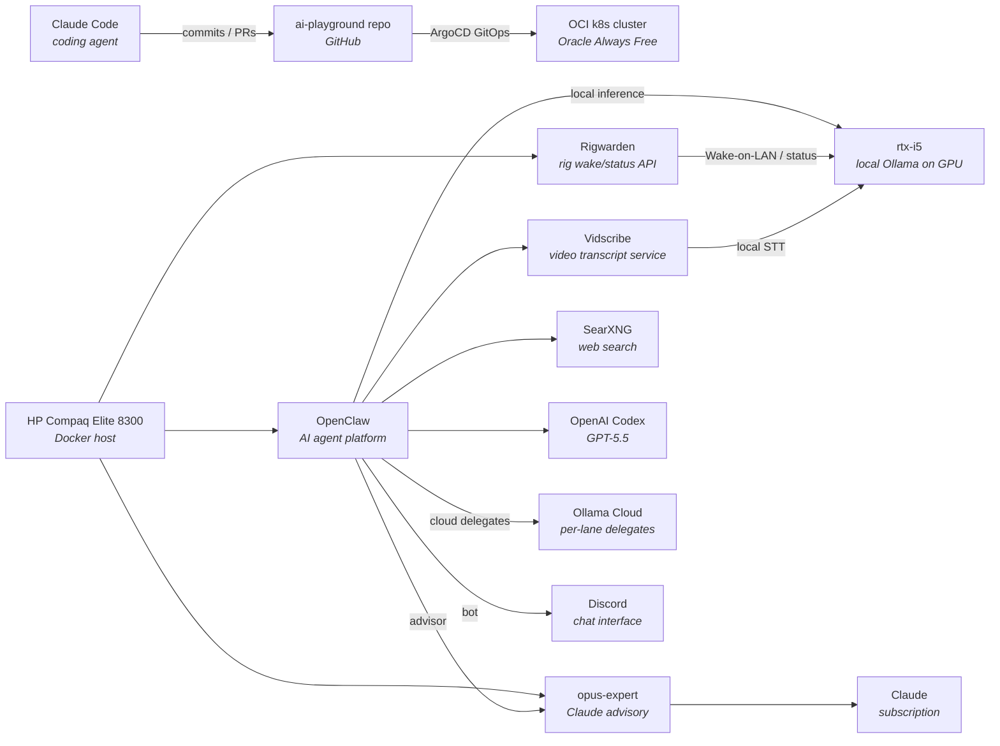

# Homelab

Living documentation of my homelab — the infrastructure side of an AI learning journey. This directory captures *what's running*, *how the pieces fit together*, and *every change along the way*.

Kept cost-free where possible (free tiers, self-hosting, local models) so the focus stays on learning.

## Current state

A Kubernetes cluster on Oracle Cloud drives GitOps workloads. An HP node runs the AI control plane: OpenClaw, led by Leah on GPT-5.5, plus `opus-expert` as a Claude advisory sidecar. OpenClaw delegates narrow work to internal worker models on Ollama Cloud, picked per lane after benchmarking: GLM 5.1 and MiniMax for coding, DeepSeek V4 Flash / Gemma / Kimi for research, and GPT-5.5 workers for second opinions.

Local hardware is used where it adds something the cloud delegates do not. `rtx-i5`, a private GPU rig (i5-9400F / GTX 1080), serves local inference and local STT workloads on owned hardware. Rigwarden controls wake/status for GPU rigs, while Vidscribe turns video sources into reusable transcript artifacts.

## Components

| Component | Role | Link |
|---|---|---|
| Claude Code | Coding agent driving all changes in this repo | [docs](https://docs.anthropic.com/en/docs/claude-code/overview) |
| OCI k8s cluster | Compute target for workloads, GitOps via ArgoCD | [`../k8s-oci-cluster/`](../k8s-oci-cluster/) |
| HP Compaq Elite 8300 | Dedicated Docker host for AI agents and automation | — |
| OpenClaw | AI agent platform, Leah/GPT-5.5-led Discord control plane with internal worker delegation | — |
| SearXNG | Local web search backend for OpenClaw | — |
| Ollama cloud delegates | Per-lane workers for OpenClaw — GLM 5.1 leads coding with MiniMax backup; DeepSeek V4 Flash / Gemma / Kimi handle research | [ollama.com](https://ollama.com/) |
| rtx-i5 | Private GPU inference rig (i5-9400F / 32 GB / GTX 1080), Docker with GPU passthrough, LAN-only | — |
| opus-expert | Claude advisory system on HP, CLI (`ask-opus`) + internal REST API; also consulted by OpenClaw as an expert advisor | — |
| Rigwarden | Wake-on-LAN and lightweight status API for GPU rigs; designed to move to a Raspberry Pi near the rigs | — |
| Vidscribe | Internal transcript artifact service: caption-first video ingestion with local faster-whisper STT fallback on `rtx-i5` | — |

## Changelog

Every homelab change — across the cluster, future edge devices, networking, and AI milestones — is logged in [`CHANGELOG.md`](CHANGELOG.md) in reverse-chronological order.
