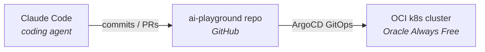

# Architecture Diagrams

Canonical Mermaid source for the homelab. The README embeds a copy of the current diagram for GitHub rendering; update both when the architecture changes.

## Current

```mermaid
graph LR
    CC["Claude Code<br/><i>coding agent</i>"]
    REPO["ai-playground repo<br/><i>GitHub</i>"]
    K8S["OCI k8s cluster<br/><i>Oracle Always Free</i>"]

    CC -->|commits / PRs| REPO
    REPO -->|ArgoCD GitOps| K8S
```
