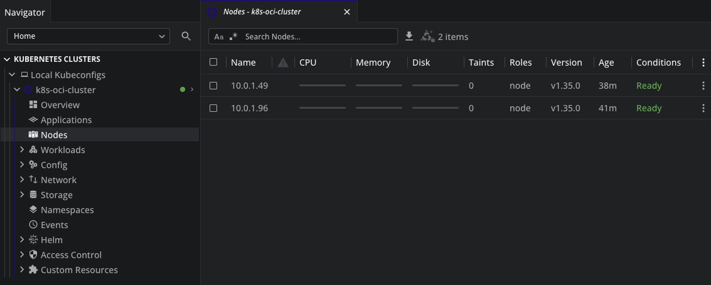

# Kubernetes on OCI Free Tier

## Goal

Run AI workloads on a free Kubernetes cluster using Oracle Cloud Infrastructure's Always Free tier.

## Background

Oracle Cloud's [Always Free tier](https://www.oracle.com/cloud/free/) is one of the most generous cloud offers available for experimenting — especially for compute. The OKE (Oracle Kubernetes Engine) control plane is always free, and the Ampere A1 ARM shapes provide solid resources at no cost.

Inspired by [nce/oci-free-cloud-k8s](https://github.com/nce/oci-free-cloud-k8s), rewritten with additional documentation and configuration changes.

## Cluster Setup

- **Engine:** Oracle Kubernetes Engine (OKE) — free managed control plane
- **Worker nodes:** 2 nodes, each with 2 OCPUs (4 vCPUs) / 12 GB RAM / 100 GB block storage (NVMe SSD)
- **Shape:** VM.Standard.A1.Flex (ARM Ampere A1, from the Always Free allocation of 4 OCPUs / 24 GB RAM)
- **Ingress:** nginx ingress controller with an OCI free-tier load balancer (Cloudflare-only source IPs)
- **DNS:** external-dns with Cloudflare provider for automatic DNS record management (proxied mode)
- **TLS:** cert-manager with Let's Encrypt certificates via Cloudflare DNS-01 challenge — enables Cloudflare Full (Strict) TLS mode for end-to-end encryption
- **GitOps:** Argo CD for continuous deployment from Git

See [Prerequisites](docs/prerequisites.md) before running Terraform.

## Usage

### 1. Deploy the cluster

```bash
cd cluster
cp terraform.tfvars.example terraform.tfvars
# Edit terraform.tfvars with your compartment_id, ssh_public_key, and k8s_api_source_ip
terraform init
terraform apply
```

`terraform apply` creates a kubeconfig file at `~/.kube/k8s-oci-cluster-config`. Use it to interact with the cluster:

```bash
export KUBECONFIG=~/.kube/k8s-oci-cluster-config
kubectl get nodes
```

> [!TIP]
> **A1 capacity availability** — Free-tier A1 instances share a limited capacity pool and `terraform apply` may fail with an "Out of capacity" error. If this happens repeatedly, consider upgrading your account to **Pay As You Go (PAYG)**. PAYG moves you into the regular capacity pool, which is far less congested. Your Always Free limits (4 OCPUs / 24 GB RAM) still apply, so you won't be charged as long as you stay within them.

> [!TIP]
> **Extending worker node drives** — OCI worker nodes don't use the full boot volume by default. To expand the filesystem, SSH into each node and run `/usr/libexec/oci-growfs -y`.

> [!TIP]
> **Managing the cluster with Lens** — [Lens](https://k8slens.dev/) is a Kubernetes IDE that makes it easy to monitor and manage your cluster. It has a free personal tier and gives you a real-time view of workloads, logs, and events in a clean desktop UI.



### 2. Bootstrap platform services

Deploys the nginx ingress controller (with an OCI free-tier load balancer), external-dns for automatic Cloudflare DNS management, cert-manager for automatic TLS certificates, and Argo CD:

```bash
cd bootstrap
cp terraform.tfvars.example terraform.tfvars
# Edit terraform.tfvars with your domain, email, and Cloudflare API token
terraform init
terraform apply -target=helm_release.cert_manager  # first time only, installs CRDs
terraform apply
```

> [!NOTE]
> The first apply requires `-target=helm_release.cert_manager` because Terraform validates custom resources (like `ClusterIssuer`) against the cluster's CRDs at plan time. Once cert-manager is installed, subsequent applies work normally.

### 3. Deploy applications via GitOps

ArgoCD watches the `argocd/` directory and automatically syncs applications to the cluster. Add Application manifests there and push to Git — ArgoCD picks them up, applies them, and prunes removed resources.

```bash
# Applications are managed by Argo CD — no manual kubectl/terraform needed
# Add manifests to argocd/ and push to Git
```

## Teardown

Tear down in reverse order:

```bash
cd bootstrap && terraform destroy
cd cluster && terraform destroy
```
